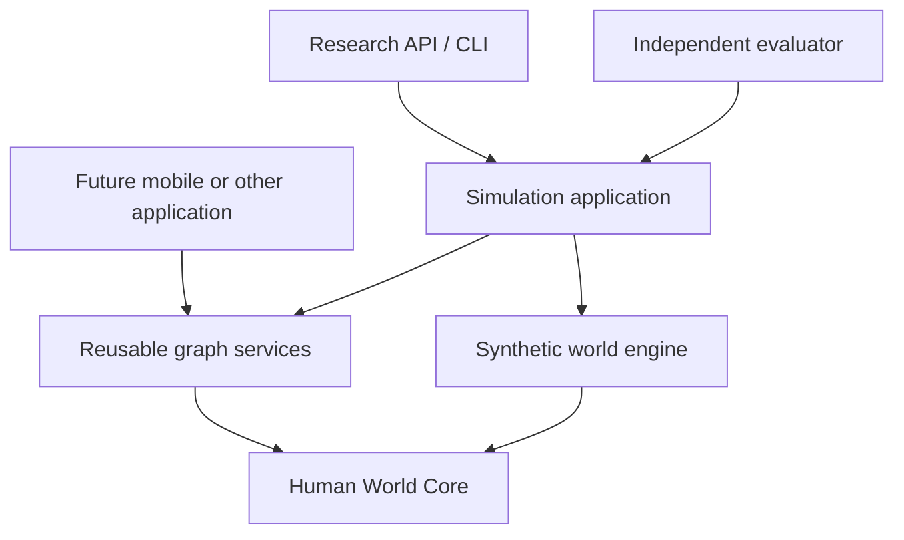

# Dream

### A laboratory for the lives between the lines.

Persistent people. Private worlds. Relationships that change.

[Vision](#the-vision) · [The simulator](#the-first-world) · [Architecture](#built-to-be-reused) · [Roadmap](#the-road-ahead) · [Build plan](https://github.com/tushardhara/dream/issues/1)

---

## Why Dream?

The name is inspired by **Dream of the Endless**, also known as Morpheus, from DC's *The Sandman*: a character associated with dreams and stories.

For this project, the connection is the space between a person's inner world and the world other people see: hopes, memories, fears, interpretations, and all the things left unsaid.

Dream asks what happens when those worlds meet—and how they change over time.

*An independent research/software project; not affiliated with or endorsed by DC.*

## The vision

Most software remembers that two people are connected. It remembers much less about **what exists between them**.

A relationship carries history, expectations, unfinished conversations, shared joy, conflicting interpretations, and promises that may or may not have been kept. Its participants do not necessarily experience the same relationship in the same way.

Dream is being built toward the **Intelligent Human Graph**: a permissioned, longitudinal understanding of people and their relationships, with a future goal of helping real human life—not maximizing time spent talking to an AI.

The first step is a controlled place to test the underlying ideas.

## The first world

The **Human World Simulator** is Dream's first application: a computational laboratory for changing human worlds.

Its basic unit is not a persona prompt. It is a persistent simulated person with history, current circumstances, competing motivations, imperfect memories, and incomplete knowledge of others.

Consider a fictional household:

> One partner receives an opportunity to travel. The household cannot comfortably afford for both to go. The other partner says, “It's okay.”

That sentence alone does not settle the story.

They might genuinely feel happy for their partner. They might also feel disappointed, protective, excluded—or several things at once. What happens next depends on their history, finances, fatigue, expectations, what each notices, and what each chooses to reveal.

A useful simulator must preserve these possibilities without declaring any one hidden motive inevitable.

### What we want to study

- How life events change state, beliefs, intentions, and behavior.
- Why the same person behaves differently with a spouse, friend, or manager.
- How private feelings and public behavior diverge.
- How memories, misunderstandings, and unresolved commitments accumulate.
- How overlapping groups develop norms, routines, tensions, and shared histories.
- How different choices—including silence—lead to different plausible futures.

The aim is measurable, testable behavior, not merely convincing dialogue.

## Built to be reused

**The simulator is the first host, not the boundary of the project.**

| Layer | Responsibility |
|---|---|
| Human World Core | Reusable people, evidence, perspective claims, relationships, groups, memory, rights, temporal state, and outcome contracts |
| Reusable graph application services | Ingestion, queries, corrections, revocation, and permitted exports |
| Human World Simulator | Synthetic latent state, drives, scenarios, virtual time, randomness, and branching |
| Infrastructure adapters | PostgreSQL, model providers, authentication, and API transport |
| Independent evaluation | Holdouts, behavioral comparisons, calibration, and falsifier reports |

Interfaces are declared by their consumers; adapters implement them, and `cmd` composes the concrete implementations.

A future application must be able to use the core without creating a simulation world, importing a branch type, or gaining access to simulator-only hidden state.

The second, non-simulator client in `examples/graphclient` exercises ingestion, differing perspectives, correction, revocation and permitted export without creating a world.

### Technical foundation

- **Go**, in a single-module modular monolith.
- **PostgreSQL**, with versioned events, temporal projections, idempotent writes, and recovery checkpoints.
- **gRPC and an HTTP/JSON gateway**, generated from versioned protobuf contracts.
- **Provider-independent model adapters**, with deterministic fakes and recorded-response replay.
- **Virtual-time simulation**, with explicit random streams and stable event ordering.
- **Independent evaluation**, separated from generation and its context.

No model vendor defines the core. No premature microservice split is required.

## Principles that survive every version

**A perspective is not a fact.** “A believes something about B” must retain its observer, evidence, uncertainty, and time.

**People are not fixed profiles.** Stable tendencies influence behavior; events and experience can change it.

**Knowing is not permission to reveal.** Read, derive, disclose, and attribute rights are separate. Derived information must not bypass source restrictions.

**Hidden state stays hidden.** An actor sees permitted observations and their own allowed state—not another actor's private mind, future events, or evaluation labels.

**WAIT is a real action.** Silence, delay, and inaction must be represented and measured.

**Relationships are not one score.** Conflicting perspectives and multiple dimensions cannot be replaced by a universal relationship-health number.

**History matters, and so does correction.** Events have occurrence times; actors learn about them at different times. Revocation must reach derived state, caches, and exports.

**Reproducibility must be honest.** Compatible deterministic or recorded runs can be replayed exactly. A fresh model call is a new stochastic experiment, even with the same seed.

**Better prediction must not become better manipulation.** The long-term objective excludes covert persuasion, forced agreement, dependency, and engagement optimization.

## The road ahead

| Stage | Engineering objective |
|---|---|
| Foundations | Domain boundaries, events, scenario validation, virtual time, and recovery |
| Changing people | State, appraisal, drives, memory, and perspectives |
| Changing relationships | Edge-specific context, groups, information boundaries, and typed behavior |
| Research backend | Replay, counterfactual branches, authenticated APIs, exports, and operational controls |
| Evaluation and demonstration | Multi-seed comparisons, calibration readiness, and a 24-person synthetic world |
| Later | Research console, longer studies, and applications built on the same core |

The bounded demonstration supports **24 simulated people, 8 overlapping groups, and 104 directional relationship reports**, with a configurable horizon of up to 12 model months. A five-person H/W/S/A/B fixture makes observer-specific relationships easier to inspect.

A **30-day real-time study** is a separate operational milestone. It is not equivalent to advancing the simulated clock by a month.

See the [master epic and dependency-ordered tickets](https://github.com/tushardhara/dream/issues/1) for executable scope, acceptance criteria, and current progress. Issue numbers are identifiers, not execution order.

## Research, not a claim of mind-reading

Synthetic consistency is not real-human validity.

Dream's research plan includes baseline comparisons, ablations, multiple seeds, frozen holdouts, uncertainty reporting, and tests designed to expose failures—not just highlight appealing examples.

Claims about real humans require appropriate consent, independent data, and external validation. When evidence is unavailable, the result is **not tested**, not “passed.”

Production relationship advice, real-user interventions, matching, and autonomous model-weight training are outside the current backend build.

## Development status

**Backend research implementation.** Durable graph services, bounded simulation, authenticated management APIs, replay/revocation/export, an independent evaluator and a synthetic demo are implemented. The alignment work adds the supplied 22-drive and 27-action registries, observer-owned relationship contexts, and complete 13-exit/10-falsifier reporting.

This is not the full Intelligent Human Graph product or a validated human model. Both integration programs are merged into `main`: [aggregate PR #38](https://github.com/tushardhara/dream/pull/38) (epics [#1](https://github.com/tushardhara/dream/issues/1) and [#39](https://github.com/tushardhara/dream/issues/39)) and [aggregate PR #70](https://github.com/tushardhara/dream/pull/70) (epic [#49](https://github.com/tushardhara/dream/issues/49)). Post-merge hardening is tracked by [epic #76](https://github.com/tushardhara/dream/issues/76). Merging `main` remains owner-only.

### Getting started and verification

Install Git, Make, Python 3, Go 1.27.1, a C compiler and Docker, then run `make verify` from the repository root. On the shared host, first follow [test resource safety](docs/test-resource-safety.md) and run heavy commands under `scripts/disk-guard.py`, accounting all retained role files.

`hws scenario validate examples/scenarios/quiet-overlap.yaml` validates the synthetic scenario offline. The authenticated gRPC/HTTP API is available through the transport host; `hws-api --config <file>` runs an explicit management-only profile with trusted credentials/view grants and a non-owner PostgreSQL connection. It never chooses a fake simulation policy: step/run-until require an embedding execution host with a configured handler. Development listeners are loopback-only; deployment requires TLS. See [transport composition and limits](docs/adr/0013-authenticated-transport.md). `hws-worker` provides bounded model/outbox maintenance; `hws-admin` supplies explicit migration and quarantined restore commands. See the [single-host operations runbook](docs/operations.md). Verification covers static/race checks, pinned protobuf/gateway/OpenAPI regeneration, real PostgreSQL role and revocation tests, and purge-aware backup/restore. No live provider or paid study is run by these checks. See [offline evaluation](docs/evaluation.md) for frozen evidence reports and their scientific limits.

See [Contributing](CONTRIBUTING.md), [architecture](docs/adr/0001-backend-boundaries.md), [requirements and gaps](docs/requirements.md), [pinned tools](docs/toolchain.md), and [agent workflow](docs/agent-workflow.md).

Current development follows the single-branch [agent workflow](docs/agent-workflow.md):

- `main` is the only long-lived branch. Ticket branches come from `main` and PRs target `main`, unless a live epic names a temporary integration branch (epic #76 uses `post-merge-integration`).
- One agent implements; an independent agent reviews at exact SHAs; neither approves or merges its own work.
- Tests and review evidence are tied to exact revisions and recorded on the ticket and PR.
- The owner alone merges `main`.
- Spending, deployment, real-person data, and material scope changes require separate authorization.

Private source documents, personal data, credentials, and unapproved provider transcripts must not be published in this repository.

---

**Understand the person. Preserve the perspective. Study the possibilities.**

Run `make demo-check` for the bounded synthetic backend demo: 24 fictional adults,
eight overlapping groups, 104 directional relationship reports, two recorded/fake seeds and a
12-model-month simulated horizon, with replay, own-view export and restart checks.
The printed `bin/demo-run-<id>/acceptance.json` records actual timing and limitations.
See [backend demo](docs/backend-demo.md), [separately gated 30-real-day study
protocol](docs/study-protocol.md) and [backend console handoff](docs/research-console-contract.md).
No real 30-day study, live/paid provider, deployment, UI or human-validity result is
claimed by this command.

### Offline helper experiments (epic #49)

`go run ./cmd/hws-assistance -seed 11` runs a bounded two-person/eight-turn synthetic
example with no-assistant, explicit-preference, single-perspective and
multi-perspective arms (#50). Humans continue choosing actions in every arm. Helper
delivery counts are mechanical diagnostics, **not benefit or relationship metrics**.
The helper uses separately permitted evidence and fixed deterministic templates;
this does not demonstrate language understanding or real-human validity.
See [ADR0021](docs/adr/0021-helper-contracts.md) for scope, replay, privacy and the
independent non-simulator host. Local builds/tests use the existing disk guard.

The other offline consumers, with the `make verify` gate that exercises each:

- `hws-listening` (#54, `make listening-check`): goal-aware listening; each person receives their own account and only separately permitted words from the other.
- `hws-repair` (#55, `make repair-check`): two multi-period sequences from one breach, contrasting repeated apology with observed practical follow-through.
- `hws-group` (#56, `make group-check`): five- or 24-person group history, care agreements and unequal burdens.
- `hws-ordinary` (#57, `make ordinary-check`): ordinary-enjoyment arms (none, generic, permitted context) over four families.
- `hws-eval -uplift` (#58, `make uplift-check`): matched-arm comparison across all eight scenario families; every comparison is reported and no uplift is claimed.
- `response-report` (#53) and `temporal-report` (#48) regenerate the committed
  `docs/evaluation/recipient-response-v1.json` and `docs/evaluation/temporal-v1.json`; they are not yet under `make build` (#78).

See [backend demo](docs/backend-demo.md) and [Contributing](CONTRIBUTING.md) for the
full command table. None of these runs a live provider, real-person data, a UI or a
real study.
